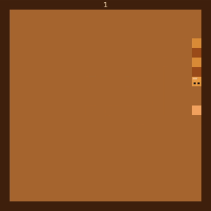

# Copperhead

An arcade-style Snake game written in Rust.

## Controls

- **Arrow** keys: Move the snake.
- **Space**: Start or restart the game.
- **Escape**: Quit game.

## Requirements

- Rust (latest stable recommended)
- [piston_window](https://crates.io/crates/piston_window)
- [rand](https://crates.io/crates/rand)
- [image](https://crates.io/crates/image) (program icon)
- [winit](https://crates.io/crates/winit) (window centering)

## Building

- Build only: `cargo build`
- Build and run: `cargo run`.

## License

This software is licensed under the [CC BY-NC-SA License](https://creativecommons.org/licenses/by-nc-sa/4.0/).
